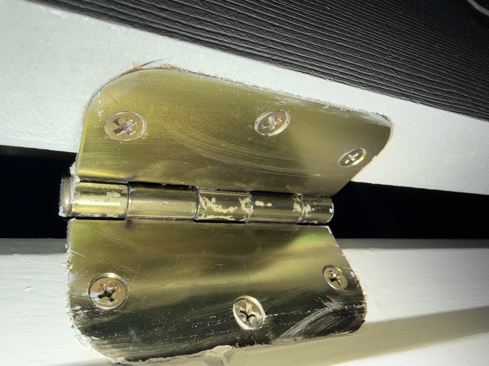
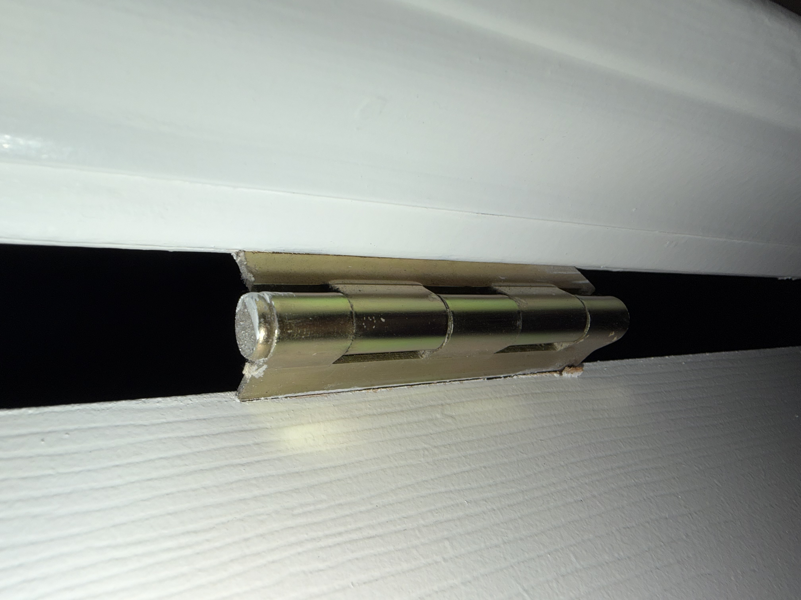

# A1 – [Build Your Professional Portfolio]

## Objective

Analyze: Identify the governing model, state its assumptions, and apply it to the right problem.

Decide: Make a choice between alternatives, document your criteria, and justify your selection.

Communicate: Present your reasoning so clearly that a colleague can reproduce your work without asking you a single question.

## Analyze

Task A: Portfolio Analysis

The first portfolio example which I pulled from the GitHub website is that of Nathan Hoong from the University of San Diego. His portfolio is linked here: https://nhoong.github.io

This portfolio displays a preview of each project he has completed on the home page of the portfolio with images and a brief explanation of the objective and result of each project. Under his largest project, his senior capstone, there is a link to the full report that allows one to explore the entire project in more detail.  

Each project Nathan completed can be found in under 60 seconds by scrolling down the home page of his Github portfolio. 

Nathan's senior capstone involved creating a test fixture to perform fatigue testing, with the dimensions for major parts being mostly present within the report. However, some parts and their dimensioned drawings were missing from the full report. Other projects involving CAD only included renders of the parts, lacking the dimensions and material properties needed to recreate the project. His coding projects also did not show the coding needed to recreate the projects. 

The senior capstone included a full report which covered how decisions involving the project were made, with the results of those decisions also being covered. The other projects listed on Nathan's portfolio do not go into the decision-making process of the designs, only laying out the objectives and resulting product. 

Nathan's portfolio meets the standards of employers and would be appropriate to distribute. It is presented using concise language explaining Nathan's background and projects that use images to display more information. It also includes links to more detailed reports when necessary, allowing his projects to be explored in full. Necessary contact information and an up-to-date resume is included at the bottom of the page. Although some links to technical documents and specifications are not available on this page, they could be sent to employers if more details are requested. 

The second portfolio is that of Frederick Wachter from Drexel University, who competed his Bachelor's and Master's degree in 2018. His portfolio is linked here: https://fwachter.github.io

Frederick's portfolio is set up with labeled tabs that navigate between information about himself and his experience. This includes a tab with his project portfolio, with each project having a brief description with links to various resources that go into further detail. 

Each project could be found in under 60 seconds by clicking on the "Project Experience" tab and scrolling through each entry, hovering over them for more information.

Each of Frederick's projects did not include specifications which would be necessary to properly recreate the project. The resource links on his projects are not labeled, with many of them no longer functioning properly. Components were described in detail on some projects, such as the Swerve Robotic Platform, but not enough information was provided to recreate the project. 

Each of Frederick's projects contain links to further information on their objectives. However, some do not contain the decision-making process or the final results of the project. More fleshed-out projects, such as the soccer robots built for the ASME 2018 Student Design Competition have information covering the full engineering process including the design process and resulting product. 

In its current state, Frederick's portfolio would not meet employer's expectations solely due to the many broken links within his projects. However, this is likely due to the age of the portfolio dating back to 2018 and could be resolved with updated documents. Beyond that, the provided information is concise and contains informational details on himself and his work, with the overall layout of the page allowing for all necessary information to be locatable and displayed. All relevant contact information is also available for employers.

Frederick's language within his portfolio would meet the expectations of an employer, with the descriptions of himself and his work being concise and informational. Furthermore, details regarding the purpose of the project, such as design competitions, and their results are provided, making his work traceable. However, the portfolio would need to be updated with working links before being sent to employers.

Task B: Product Analysis

The physical product I will be discussing is the door hinge, which can be found throughout my home. Its purpose is purely mechanical and only contains three primary components, that being the leafs, knuckle, and pin.

The primary function of the door hinge is to control the opening and closing of a door. It allows the door to pivot about one side of the door frame while keeping the door supported and aligned within the frame. 

The governing model that describes a door hinge is a rotational joint. Its variables include its position (\theta), described by the angle the hinge is relative to the frame, as well as its angular velocity (w) and acceleration (\omega). Variables also include the torque (T) applied, and the moment of inertia (T) resisting rotation. To ensure the model is valid, it is assumed that the hinge remains fixed to the door frame, keeping the axis fixed as well.

There are many patents involving door hinges, but the one I will be referencing is US2786229A, providing a classic overview of the door hinge by Jolm D. Carroll from 1954. 

This pictures shows the leafs which are screwed to the side of the door and door frame to secure the door hinge in place. The large and flat area of the leafs on both sides ensures a secure connection and allows the door to remain fixed on its axis. The edges of the leafs form the knuckle in the center of the two leafs, allowing a space for the pin to be inserted and secured in place. The connections on both the door and frame allow the force exerted on the door to be transferred to the knuckle and changed to rotational motion.

This pictures shows the other side of the door hinge, showcasing the knuckle and pin. The knuckle is formed by the two leafs, creating a space for the pin to be inserted through and properly secured. While the knuckle transfers forces on the door into rotational motion, the pin ensures that this rotation remains fixed along the axis. This constraint ensures the door does not experience translational motion when being pushed.

As noted, the primary function of the door hinge is to control how the door opens and closes in a way that is consistent and reliable. There are many alternatives to this which accomplish the same function. One common example is the sliding door, which utilizes fixed rails and rollers with bearings to allow lateral forces on the door to translate into a smooth sliding motion to properly open and close the door. Other examples improve upon the original design of the door hinge, such as continuous door hinges. Continuous hinges utilizes the same leaf, knuckle, and pin construction but stretches the entire length of the door. This allows one singular assembly rather than the two or three door hinges needed traditionally. This solution provides better weight distribution along the hinge, making a more stable door that less vulnerable to sagging over time. 

One interesting design choice of the door hinge is the pin not having any hard mounts which secures it to the knuckle. This is likely done for making the installation and removal process of the door hinge faster, without the need to remove the leafs from the door hinge and frame to disassemble the hinge.  

## Decide

## Communicate

