# A2 – Truss Stress Analysis

## Objective

The objective of this assignment was to create a lightweight planar truss given geometrical constraints that can withstand a given load. This involved creating free body diagrams for joints and pins, solving for external and internal forces, and determining the cross sectional area of both members and pins. Furthermore, safety factors also needed to be taken into consideration. Then, weight of each part was to be estimated. Finally, a CAD model of the truss design with accurate dimensioning and connections was to be created and tested for weight accuracy and performance. 

## Analyze

>Values and Constraints

Before I began creating a design, I took the time to look over the constraints and values I was given for this project. Firstly, we were required to use A500 structural steel for our truss members, while the pins were made of a hardened tool steel with given specifications listed later in the assignment. The safety factor to be used for the members was set to 3.5, with pins having a higher factor of 4. An image was provided showing the constraints of the design, pictured below: 

Point B was specified to be a roller while Point A was a pin. We were also given the values of a and b, being 0.4m and 0.3m respectively. P was to be a range between 20-30 kN, in which I chose 20kN. 

## Decide
_Which geometry did you select, and why? This is your first open design choice in the course — defend it._

>Creating the Design

To design the truss, I began by connecting all of the points alongside one another, creating a trapezoid that would serve as the outer members of my truss design. It was noted to keep our geometry simple, but I knew that triangles are the most effective at supporting a load. With this in mind, I created a cross member that went from point B to D, providing added support. I deliberated between going from B to D or A to C, but I decided that an extra member on the downward acting force would be more effective. I also thought about doing both members, but the crossing members on a planar truss would make the design to complicated to recreate in CAD and open to errors. 

>Solving the Design

Once my design was completed, I began to solve for the lengths of each member using Pythagorean theorem. I then generated a free body diagram of the outward members and external forces, solving for the unknown pin forces. 

I then moved on to internal forces, using the joint method to solve for the force on each member and determining if they were in tension or compression. 

Once forces were solved for, I then focused on solving for the minimum area needed for the truss to withstand the forces. By laying out what I already knew and needed to find and deriving an equation, I solved for the minimum area of the truss members. I then used this value along with the length of the members to find the total volume of the members, combining that with density to get the total mass. I then used this mass to find the weight of the members. 

>Solving the Pins

I then followed the same methodology for the pins, including a free body diagram of pin A to get a better understanding of how it was being affected by the forces acting on the pin. At first, I was going to make the pins flush thickness of the truss members. However, I believed that I should extend them outwards slightly in the case that they would be used to connect the truss to a larger project, such as a bridge. At this point, I also decided to set the cross sections of the truss to square, as it allowed for a simpler calculation of the area needed for the pins. It also made creating the truss on CAD more efficient. I assumed that pins would be utilized at each of the joints, so I multiplied the original found weight by 4 in order to get the total weight of the pins. 

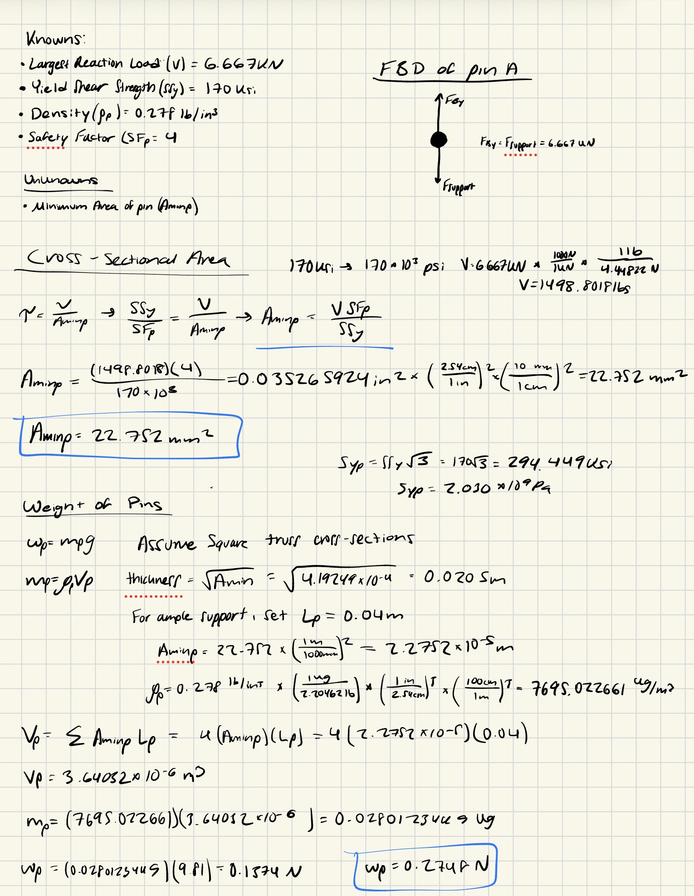

>3D CAD Model

Moving to Solidworks, I began to work on my 3D model of my design. I started by creating a front facing sketch of all the members, which I would later extrude. 

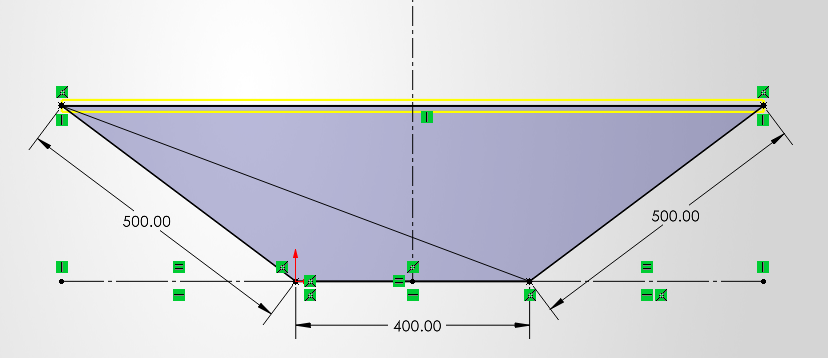

In order to extrude this sketch, I created the cross section of the members as a separate sketch. For my planned extrusion method, I had to ensure that these cross sections for each member was perpendicular to the sides of the member, which required some extra planes to be added. 

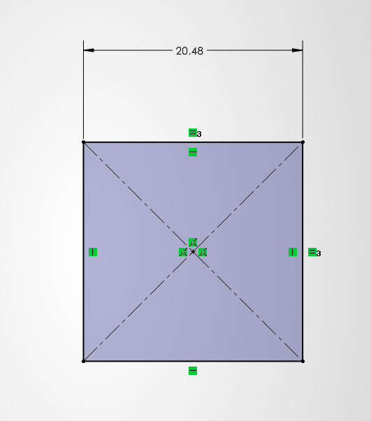
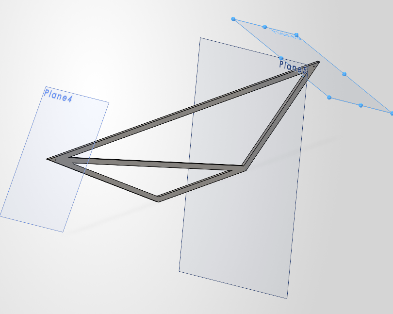

I would like to note the pointed edges of this truss design which I later moved away from. After the extrusion, I thought that I should connect the trusses in a way that made the design cleaner. However, this solution led to many problems when creating the pins that stopped the pins from supporting the truss properly in the software. This led to the idea being scrapped. 

Moving forward, the extrusion process involved the use of a swept boss/base extrusion, allowing me to select the member lines and their cross sections to quickly create the full truss design in the correct geometry. 

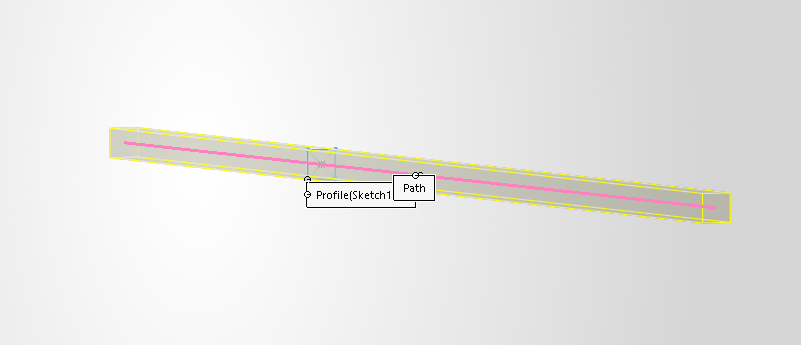
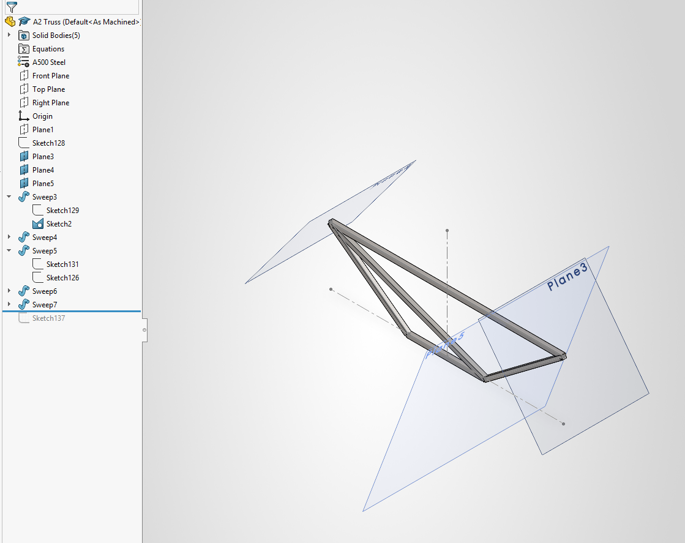

Finally, I added circular cuts with the exact area of the pins at each of the member joints to allow for the pins to be added to the assembly later on.

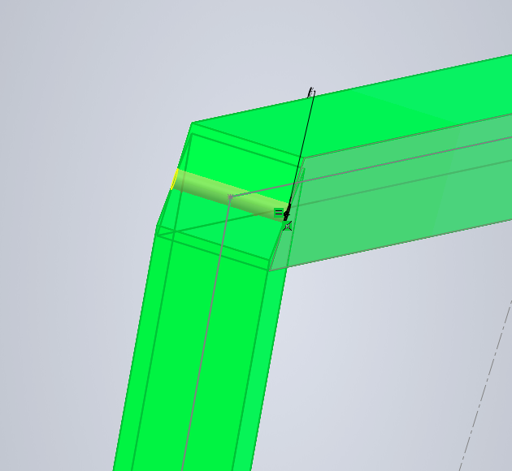

At this point, I had realized I made the mistake of not checking if the material being used was in Solidworks. Unfortunately, A500 Steel was not a material offered on the software, but I did not want to redo all of my previous calculations. To avoid this, I created my own material power and put all of the specifications of A500 steel within its properties. 

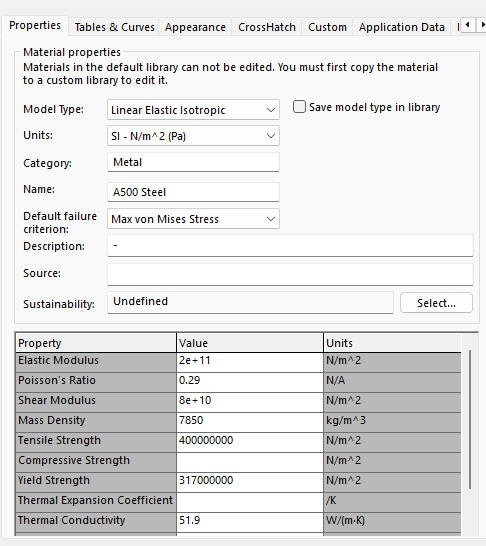

I then created the pins as a separate part, which was a simple process. I created a sketch of a circle with the correct area and extruded it to the length I decided on previously. 

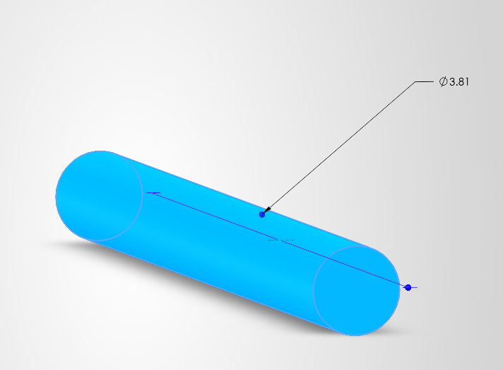

Once again, I created a new custom material with the specification of the hardened tool steel given within the assignment directions to allow for proper testing later on. 

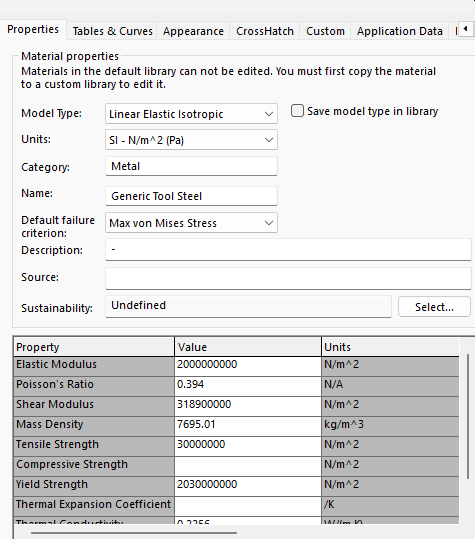

With both parts completed, I created the final assembly, including the truss and 4 pins at each joint. I aligned the pins properly using mate relations between the pin and the holes I created within the joints of each member. This created the final assembly of the truss design, which was now ready for testing. 

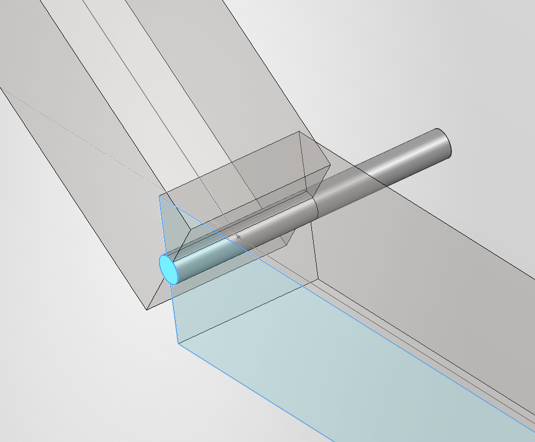
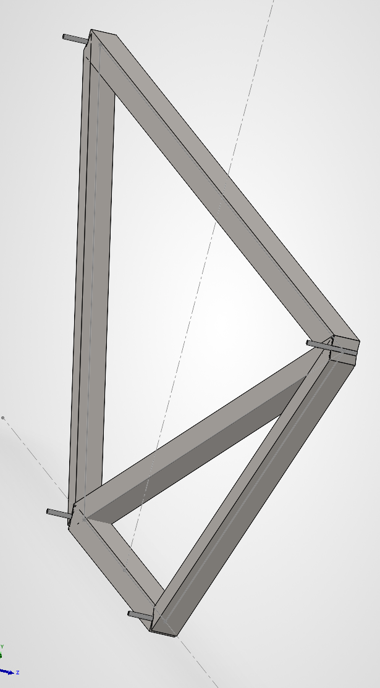

>Simulating the Design

I then created a static simulation for the truss, ensuring that each pin was characterized as one within the software. I also ensured the pin on point B was set as a roller, while point A was set as a fixed pin, with both supporting the truss within the simulation. I also added the forces at their respective points at C and D. 

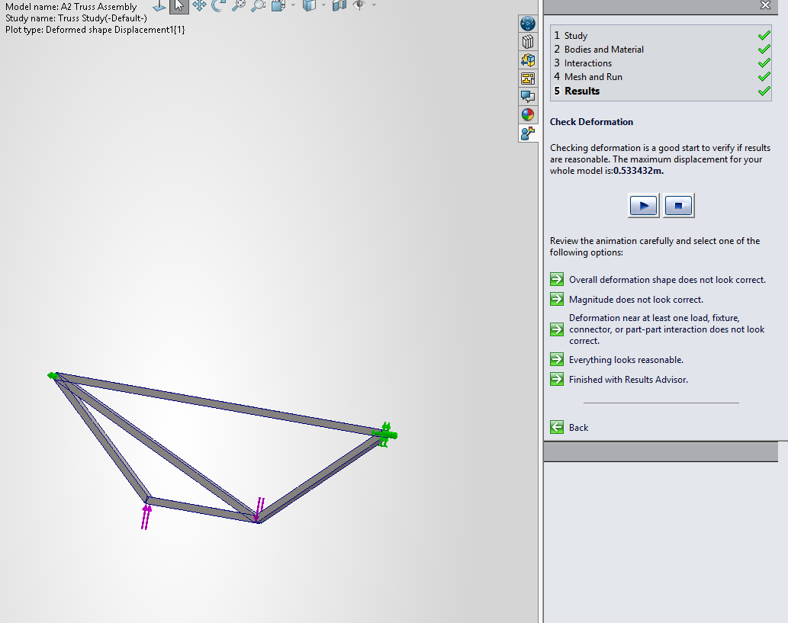

I also noticed that the truss design led to the geometry of the members overlapping with one another at their joints. To combat this breaking the simulation, I set each member as "Free" in order to allow them to pass through one another without creating unseen forces. 

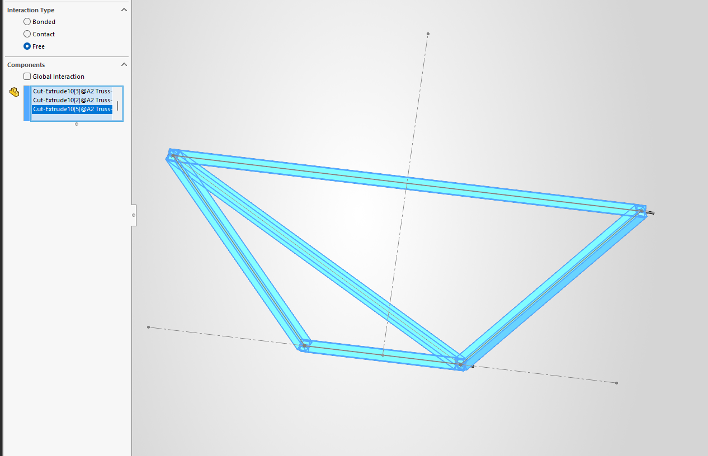

The simulation ran well, showing a low maximum deflection that coincides with a strong truss. Based on this deflection, it met the standards provided by the safety factor and other constraints. 

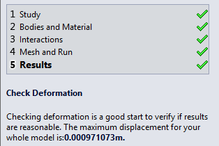

To end the assignment, I went back to the assembly to review the calculated mass of the entire truss design, which I then calculated with gravity to find the final weight. It aligned almost perfectly with the total weight previously calculated, being slightly under the original value. 

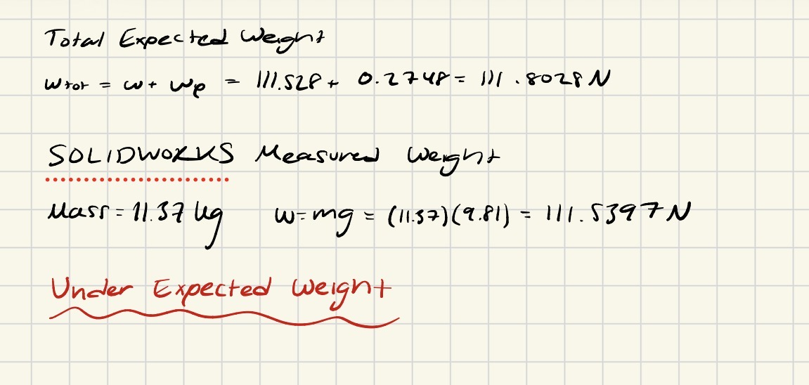

## Communicate

>Key Takeaways

By doing this assignment, I was able to learn how to create and fully define a design and bring it out of the paper and into a 3D environment. By going thorough the process, I was able to see how many of the assumptions made when making calculations need to be tackled differently when being implemented in 3D. This is evident in the joints of each member, that when in 3D create many overlaps that proved to be quite difficult to deal with. In a professional scenario where this design was being distributed, I would have had to find a way to get each member attached to the pin without overlapping or compromising the strength of the truss. This is a new skill that I will be able to apply in future projects where designs must be brought from paper to the real world, where I can anticipate changes that may need to be made. 

From start to finish, this project took about 6 hours. An hour of this time was spent with difficulties downloading and setting up Solidworks.
