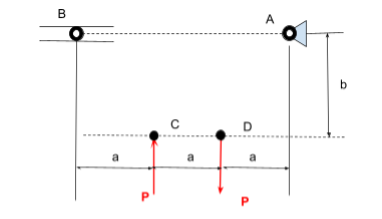
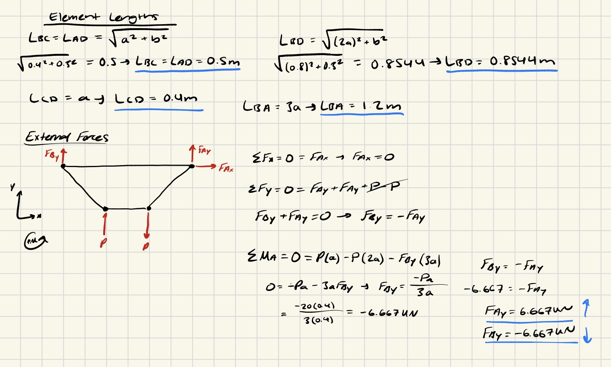
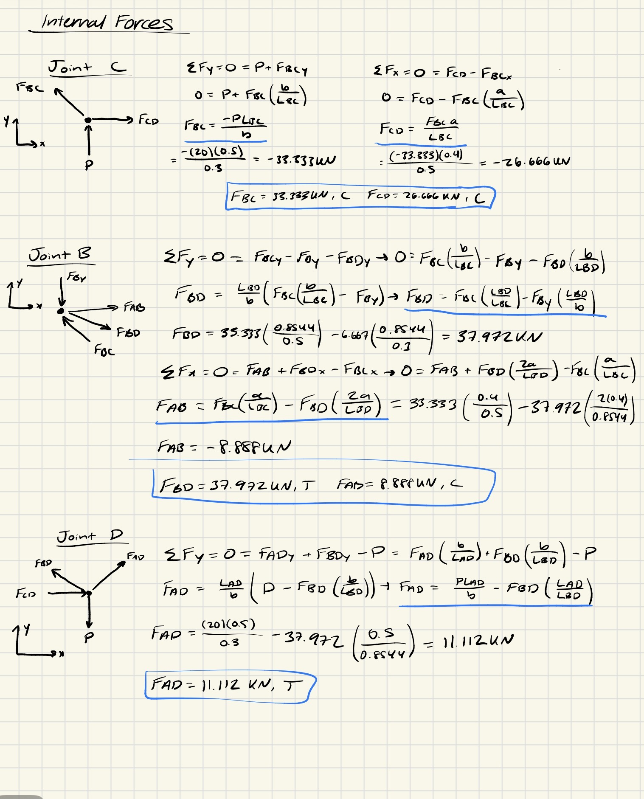
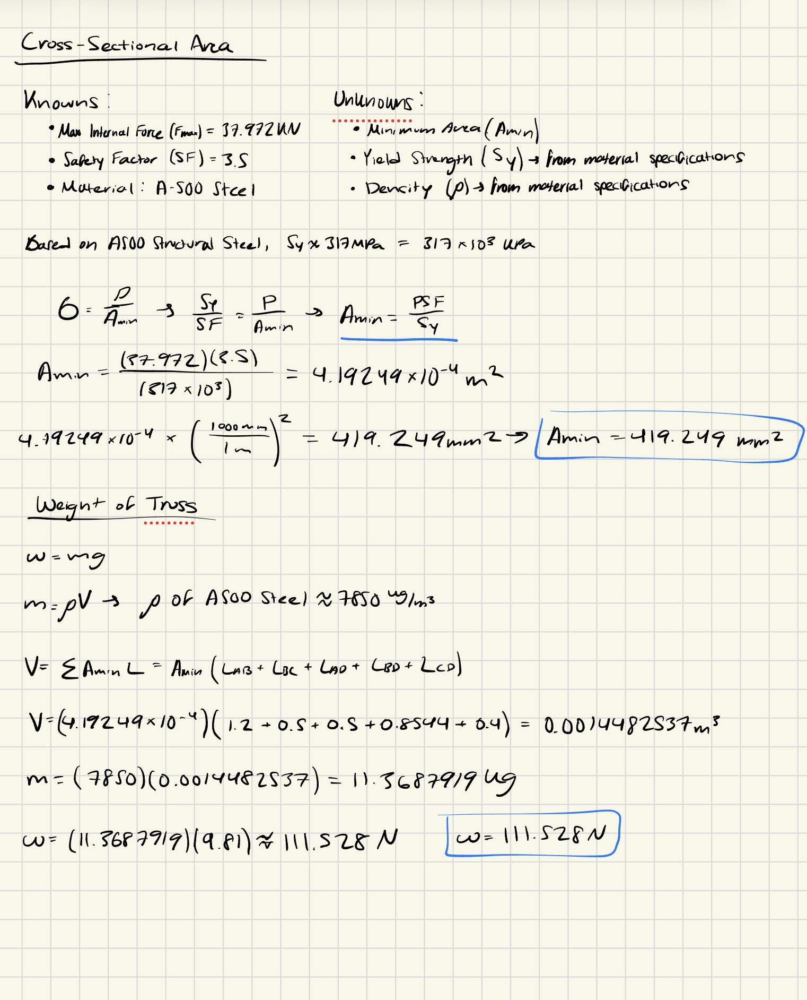
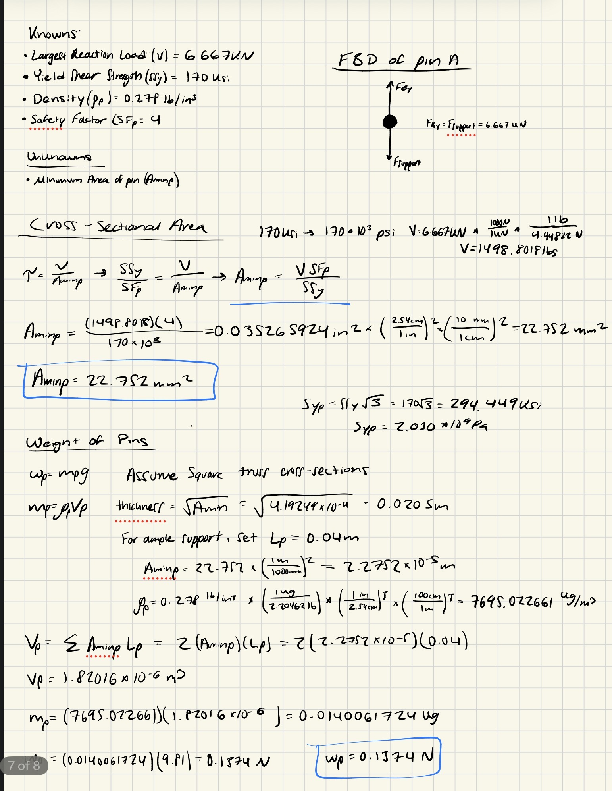

# A2 – Truss Stress Analysis

## Objective

The objective of this assignment was to create a lightweight planar truss given geometrical constraints that can withstand a given load. This involved creating free body diagrams for joints and pins, solving for external and internal forces, and determining the cross sectional area of both members and pins. Furthermore, safety factors also needed to be taken into consideration. Then, weight of each part was to be estimated. Finally, a CAD model of the truss design with accurate dimensioning and connections was to be created and tested for weight accuracy and performance. 

## Analyze

Values and Constraints

Before I began creating a design, I took the time to look over the constraints and values I was given for this project. Firstly, we were required to use A500 structural steel for our truss members, while the pins were made of a hardened tool steel with given specifications listed later in the assignment. The safety factor to be used for the members was set to 3.5, with pins having a higher factor of 4. An image was provided showing the constraints of the design, pictured below: 

Point B was specified to be a roller while Point A was a pin. We were also given the values of a and b, being 0.4m and 0.3m respectively. P was to be a range between 20-30 kN, in which I chose 20kN. 

## Decide
_Which geometry did you select, and why? This is your first open design choice in the course — defend it._

Creating the Design

To design the truss, I began by connecting all of the points alongside one another, creating a trapezoid that would serve as the outer members of my truss design. It was noted to keep our geometry simple, but I knew that triangles are the most effective at supporting a load. With this in mind, I created a cross member that went from point B to D, providing added support. I deliberated between going from B to D or A to C, but I decided that an extra member on the downward acting force would be more effective. I also thought about doing both members, but the crossing members on a planar truss would make the design to complicated to recreate in CAD and open to errors. 

Solving the Design

Once my design was completed, I began to solve for the lengths of each member using Pythagorean theorem. I then generated a free body diagram of the outward members and external forces, solving for the unknown pin forces. 

I then moved on to internal forces, using the joint method to solve for the force on each member and determining if they were in tension or compression. 

Once forces were solved for, I then focused on solving for the minimum area needed for the truss to withstand the forces. By laying out what I already knew and needed to find and deriving an equation, I solved for the minimum area of the truss members. I then used this value along with the length of the members to find the total volume of the members, combining that with density to get the total mass. I then used this mass to find the weight of the members. 

I then followed the same methodology for the pins, including a free body diagram of pin A to get a better understanding of how it was being affected by the forces acting on the pin. At first, I was going to make the pins flush thickness of the truss members. However, I believed that I should extend them outwards slightly in the case that they would be used to connect the truss to a larger project, such as a bridge. At this point, I also decided to set the cross sections of the truss to square, as it allowed for a simpler calculation of the area needed for the pins. It also made creating the truss on CAD more efficient. I assumed that pins would be utilized at each of the joints, so I multiplied the original found weight by 4 in order to get the total weight of the pins. 

## Communicate

