# A3 – Parametric and FEA

## Objective

The objective of this project is to utilize a bar design and finite element analysis to develop skills using axial deflection and parametric design to create functional models. Using FEA also creates the opportunity to test a model and determine its performance metrics by recreating the conditions it is in. Furthermore, this project introduces linking parameters in CAD software and comparing analyses and differing conditions.

## Analyze

>Bar Constraints

The bar being designed has various constraints. This includes the cross-section, which must be circular. The bar also must be made of an aluminum with a Young's Modulus range of (8.5-11.5)*10^6 psi. The max axial deflection of the bar is 0.009 inches, and has an applied direct load ranging from 300 lbf to 500 lbf. The details of the points of fixation and load are pictured within the provided diagram.

## Decide

>Selecting Parameters

The load and Young's Modulus is given in the form of a range, meaning that they must be chosen properly. For this project, I decided to choose the middle ground for each of these ranges. I decided to set the force to 400 lbf and Young's Modulus to 10*10^6 psi. This ensures that my bar is more well-rounded for loads within the given range assuming a safety factor.

>Selecting an Area

The project allows for the area to be chosen and used as a constraint for the length of the bar. I decided to compare the load to our previous A2 assignment to determine an approximate area that would create a bar that does not have an extremely low or high length. In project A2, I utilized an area of around 420 mm^2. Given conversions, I decided to set my radius to 0.1 in. This gives a diameter of 0.2 in and an area of 0.031416 in^2. The instructions note to report the width, height, and thickness, but that conflicts with the constraint of a circular cross section which only needs to be defined by its radius.

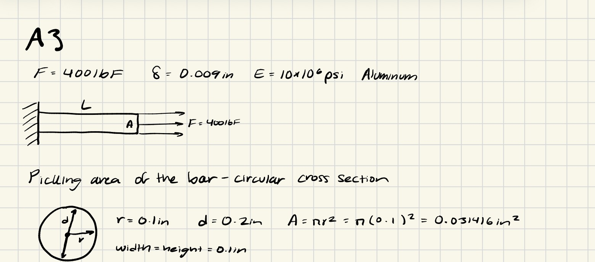

>Calculating Length

Given the area, the length of the bar can now be solved for utilizing the direct tension elongation equation. After rearranging the question for Length, I applied the values that I was both given and calculated for to determine the required length, being set to 7.0686 in.

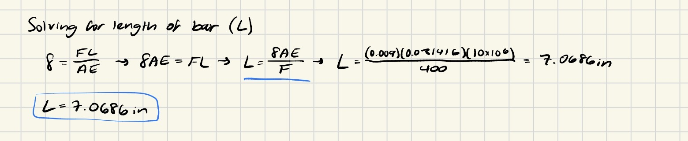

>CAD Model

The next step was to transfer this bar into CAD. Using Solidworks, I began by utilizing the Equations tool to record the values and relate them to one another. I first recorded each of the givena and chosen values, such as force, displacement, radius, and the Modulus of Elasticity. With these, I created equations that accurately calculated the cross sectional area and length of the bar. These matched the hand calculations that I made before beginning work on my 3D model. 

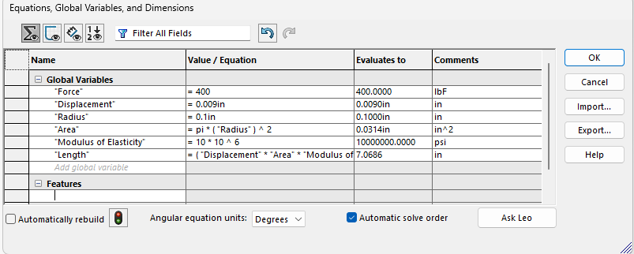

I then created a sketch of the cross sectional area on the front plane. I utilized the circle tool and set its diameter to 2 in order to create the correct cross-sectional area. 

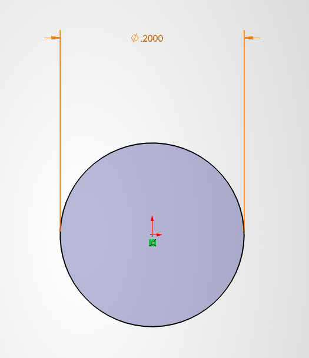

Utilizing the sketch, I created an extrusion that extended the length of the cross section. Using the variables I made using the Equations tool, I set the length to "L", which set the calculated length. Completing the extrusion finished the geometry of the bar. 

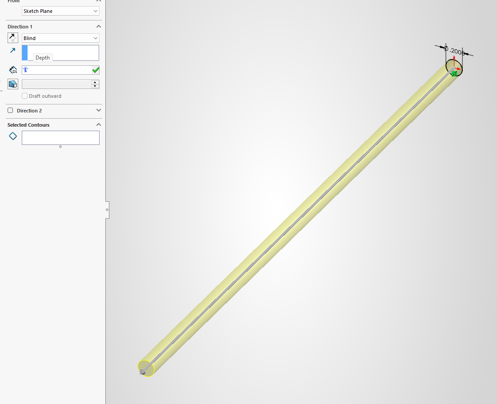

Prior to finite element analysis, I set the correct material parameters by selecting a general aluminum provided by Solidworks. I copied its parameters and made a custom material, setting the Modulus of Elasticity to the value used in this project. I then applied this new material to the model.

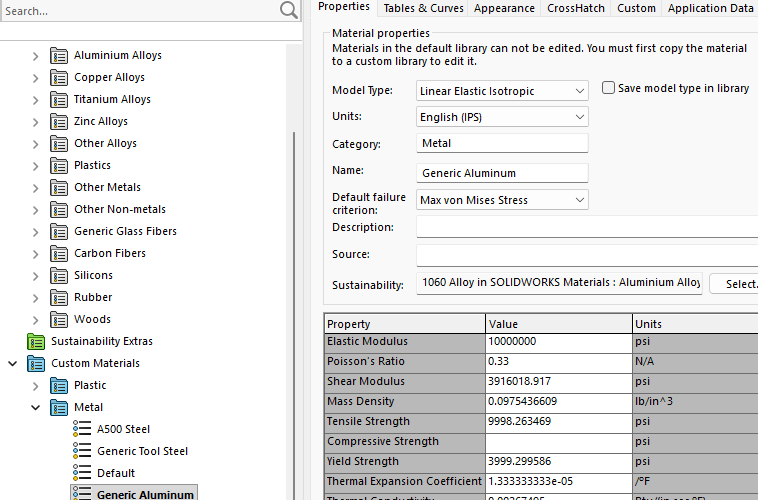

>Finite Element Analysis

To create the correct constraints for an analysis of the bar, I created a new static study that will allow a simulation to be completed. 

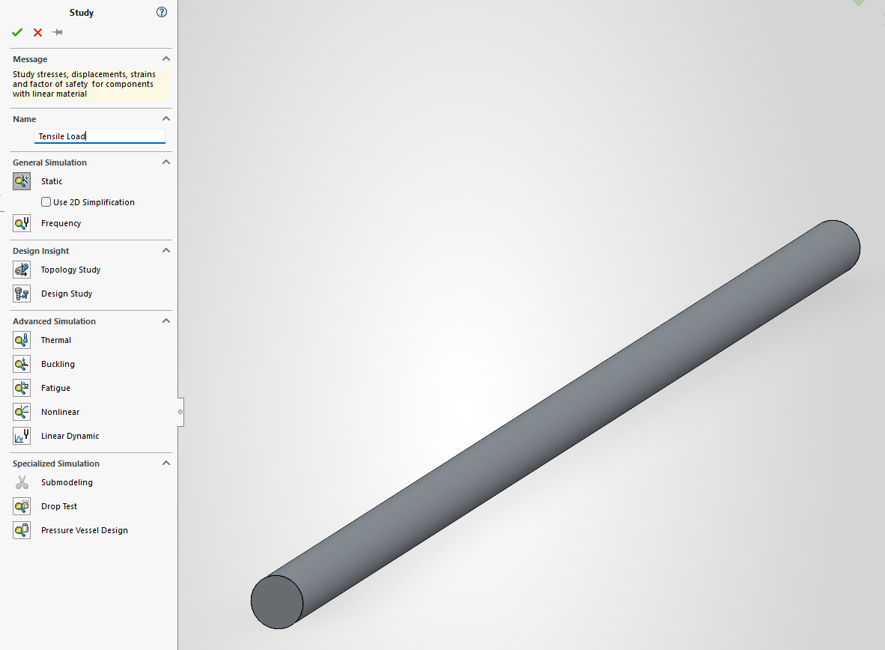

Under the study, I set one side of the bar to have fixed geometry, simulating the fixed wall the left side of the bar is attached to. I then set the other side to have a tensile load of the correct force and direction, completing the needed parameters for an accurate simulation.

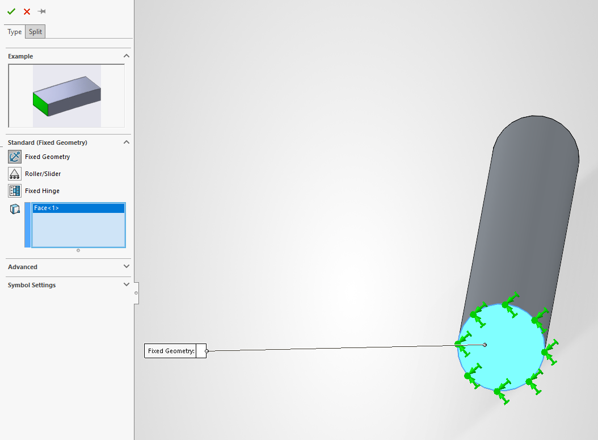

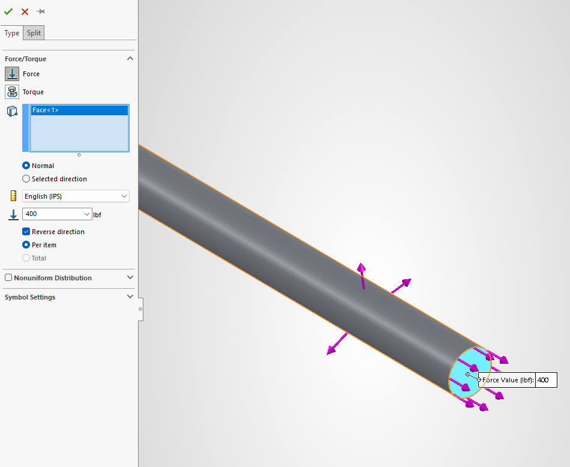

Once the parameters were set, I created a mesh of the body of the bar for a simulation, using the default detail to ensure the simulation has a balance between performance and accuracy.

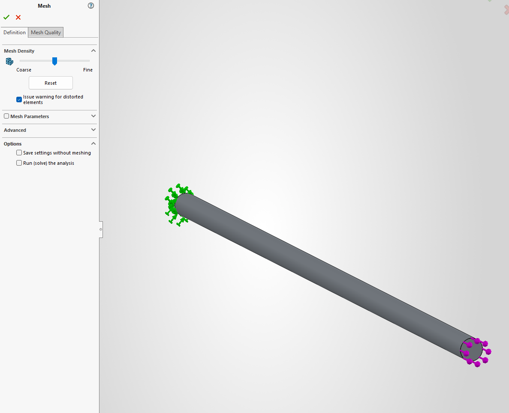

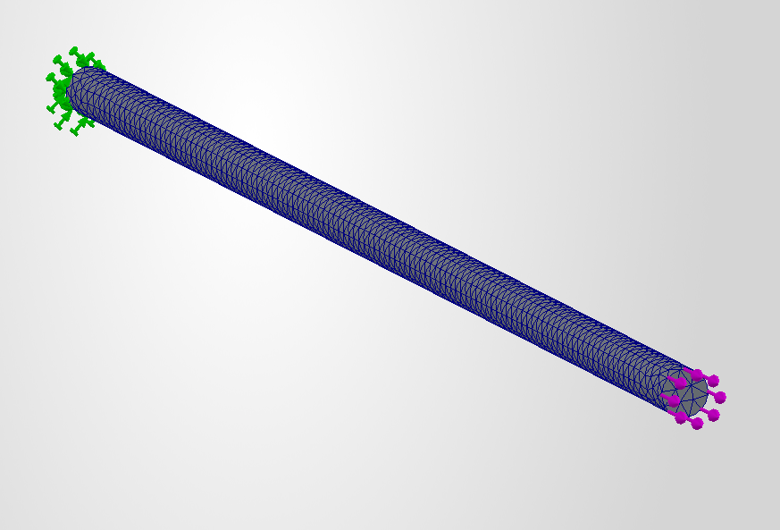

With this, I ran the simulation. This generated a deflection map and von Mises map, providing values of how well the bar performed. 

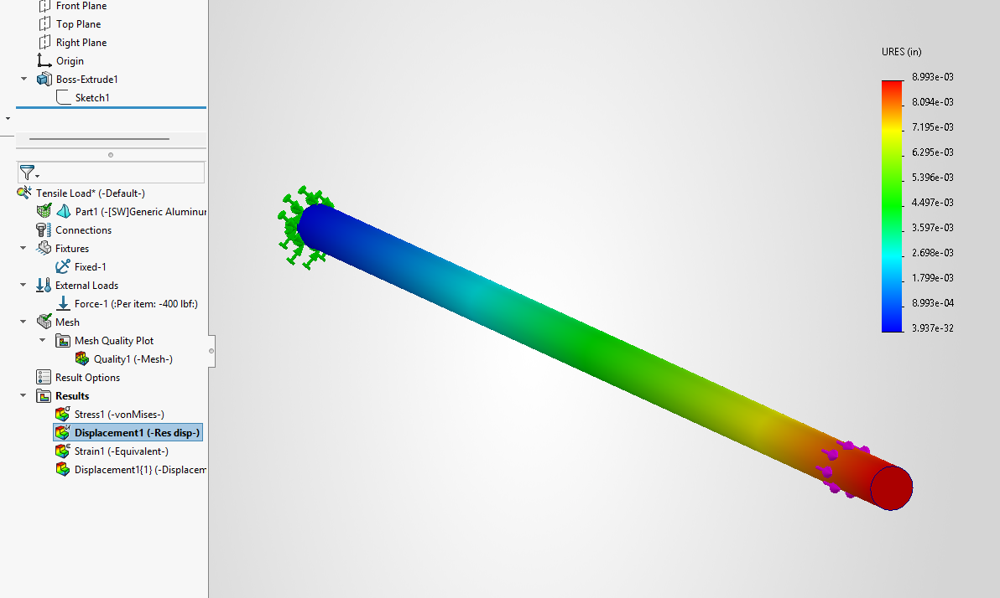

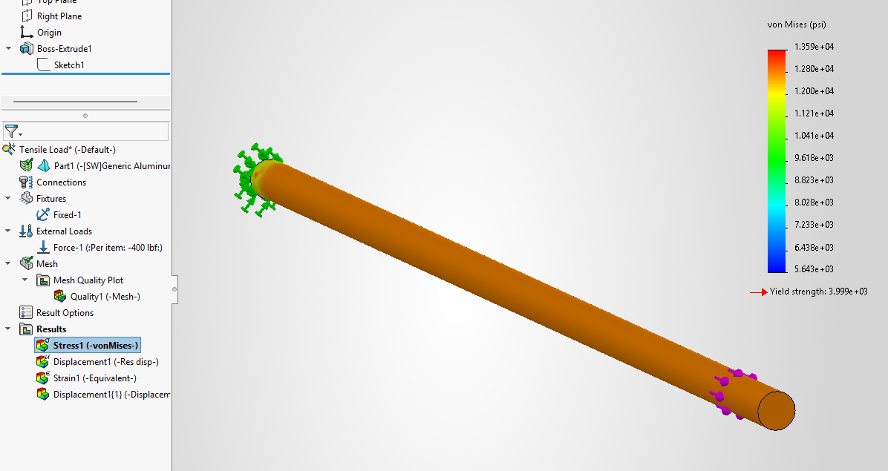

The von Mises Stress map provided a legend showing which value was represented by which color. This is constrained by the maximum and minimum stress that the bar experiences and can thus be used to determine the maximum stress of the bar. Reading the legend, the maximum stress is 3.999*10^3 psi, or 3.999 ksi.

This value can now be compared to the provided maximum stress of aluminum, Sy=40 ksi. It is far lower than the maximum stress of aluminum and meets a calculated safety factor of about 10.

## Communicate

>Comparing Simulations to Calculations

With the simulation completed, it was now time to compare my calculations to the simulation and determine which is more trustworthy. To do this, I compared the given maximum axial deflection to the value measured by the deflection map. Calculating the percent difference between both values, the difference was found to be 0.778%, which is extremely low. This means that the calculations, geometry, and simulation were very accurate and met the desired maximum deflection.

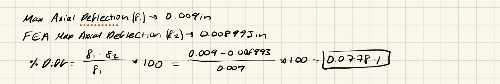

I believe that the strong similarity between the two values can be attributed to the simplicity of the model. The simple geometry and single load on one end means that equations have little room for error or inaccuracies. The detailed mesh also ensures that the simulation remains accurate and true to the ideal measured value, explaining the low percentage difference. With this in mind, I believe that the simulation is more trustworthy as it has the ability to account for more variables and complexity when compared to my known equations and calculations, which are subject to inaccuracy and mistakes. One thing that I would like to note is that simulations and models can be difficult to set up at times, with incorrect constraints leading to inaccurate and broken simulations.

>Creating a Pin Hole

To end my final analysis, I incorporated a pin hole on the left side of the bar with a diameter of 0.08 inches, making a realistic but substantial change in the geometry of the model. This substantial change means that the peak stress will vary, and must be recalculated using stress concentration factors. Using this, I determined the ratio of the diameter of the hole over the known diameter of the bar. This could then be utilized to determine the stress concentration factor using a Peterson chart, which was found to be Kt= 2.223. 

I then needed to determine the nominal stress of the bar using the previous von Mises chart. The stress on the bar is largely uniform, so selecting a single point away from the side where the pin would be would be an accurate representation of the nominal stress on the bar. Using the Probe tool and selecting a point on the bar, I determined the nominal stress to be 12.74 ksi. 

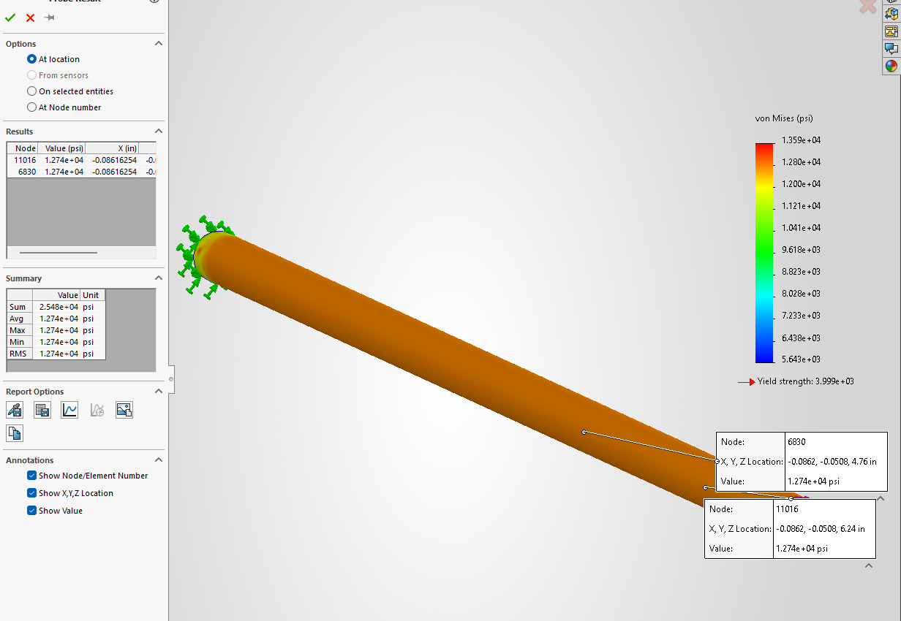

I used these values to then find the new maximum stress at the edge of the hole, finding it to be 28.4484 ksi. Compared to the value of aluminum, this still falls below the maximum stress of 40 ksi, which means it would still be safe to use with the given load. On the other hand, it is now too high to meet the calculated safety factor of 10.

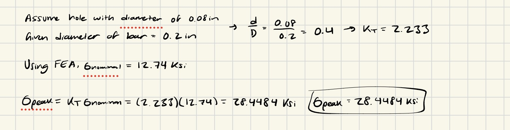

>Lessons Learned

Throughout this project, I learned how to move my skills in CAD beyond modeling and towards simulation, which I had previously not done before. I also was able to improve my skills at analyzing designs that now make me more comfortable with determining how well a design performs and how different conditions change its effectiveness. One mistake that I made in this assignment was forgetting to incorporate the Equations tool to facilitate the dimensioning of my model. Although the model was still accurate, I still corrected the error to make sure the dimensions connected with one another and would be easily manipulatable with new values. Overall, I spent about 4 hours on this assignment. 

CAD Parts and Assembly can be downloaded here:

<a href="A3 Bar.zip" download>
  Bar Part (.STL)
</a>
