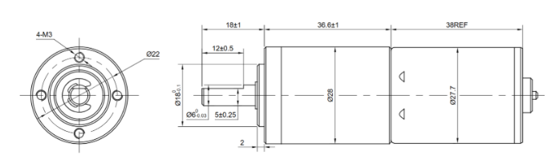

# A4 – [Topic]

## Objective

The objective of this project is to create a motor mount utilizing bending equations associated with stress and displacement. Throughout the project, I got more experience navigating constraints to create a functional design and better understood how to translate a design into 3D CAD software. This project also aimed to learn how to translate dimensions into sketches that display the dimensions in a more applicable way. 

## Analyze

>Constraints and Given Values

The motor mount being designed had various constraints. The mount is designed to hold the Brushed 24V DC Gear Motor 3.6Kg.cm/46RPM w/ 99.5:1 Planetary Gearbox, with its dimensions being given in a drawing. 

The project allowed for multiple materials to be used, including ABS, PETG, and PLA, with their properties being linked to the project page. The design contains two features, with one feature being attached to a wall and another attached to the first feature in the form of a cantilever beam, supporting the motor. Both features were to be designed with a maximum deflection of 0.3 mm at the free end with a safety factor of 3 that accounted for the holes for the screws and motor shaft. With the motor mounted, a 300N force was noted to be applied to the shaft perpendicularly. For the calculations, the weight of the motor could be ignored. Deflection of the feature attached to the wall was assumed to be zero, as well as the derivative with respect to x. 

>Design Inspriations

For design inspiration, I researched similar designs for smaller-scale electric motors. I noticed that these mounts typically had indentations which complimented the geometry of the motor it was to be used with, allowing for a more secure fit. I also noted the different mounting idea, with mounts typically using 2 or 4 screws to secure the mount. The links to these motor mounts can be found in Appendix A.

## Decide

>Defining Knowns

Before beginning calculations, I first needed to decide on my given values to set up my equations. Firstly, I needed to decide a material to use. I decided to use ABS, as not only is it very commonly used for these applications, but it is a material registered in Solidworks, allowing my material properties to be very accurate. For the ABS material, I selected a Young's Modulus of 2.5 GPa and a Yield Strength of 39 MPa to use for my calculations. I pulled these from a range of values provided in an ABS material properties table. 

I then needed to choose a thickness for both features. For feature 1 (cantilever) I decided on a thickness of 8mm, as it allowed for the shaft to stick out enough from the bottom of the feature while also maintaining a thickness that woudl not produce structural concerns. For feature 2 (fixed to wall) I choose a thickness of 6mm to ensure that it was thin enough to allow screws to go through the ABS material and be long enough to mount properly on the wall. 

>Solving Feature 1

With the knowns defined, I was now able to begin calculations. I began by drawing a free body diagram of feature 1, with the 300N force on the shaft being included. I first transferred this force to be applied to the feature by creating a force moment couple. I calculated the moment by multiplying the force P by athe distance of the edge of the shaft from the feature, giving a moment of 3N*m. I then used the max stress equation and modified it to include the given safety factor. I then rearranged the equation to solve for base width, inputted the values, and solved. Next, I used this value to calculate the moment of inertia and rearranged the max deflection equation to solve for the final dimension: the length of the feature. I applied all of the known values and solved for length, using it to calculate the minimum area needed for feature 1. 

>Solving Feature 2

Moving on to feature 2, I began with another free body diagram and transferred the force moment couple to feature 2's bottom edge where it connects to feature 1. I then solved for base width using the max stress equation. Once I solved for b, I noticed it was larger than the base width for feature 1. To ensure dimensional consistency, I made the base of feature 1 equal to this newly calculated base width. This also ensured that the motor would be fully supported at the base, as this made it wide enough to fully support the bottom of the motor. Under this reasoning, I also extended the length of feature 1 to 35mm. With this settled, I finished the moment of inertia, length, and area calculations for feature 2. I also recalculated the area for feature 1 using the new values. 

>Sketching the Design

With the calculations completed, I then created a hand drawn isometric sketch of the motor mount to scale with the provided dimensions. To refine and complete the design prior to making it on Solidworks, I incorporated the hole for the shaft, centering it on the top plane of feature 1. I gave it a diameter of 6.5mm to ensure a snug fit of the shaft while also providing it enough room to spin freely. I also included the holes for the screws, centering them along the visible inside plane of feature 2. These have a diameter of 3.4mm as given by the project. Finally, I took inspiration from the designs I previously researched and included an indentation centered on feature 1 to fit the face of the motor that sticks out slightly from the rest of the body. I gave it a 2mm depth and a diameter of 18.5mm to ensure a snug fit. 

>Creating the CAD Model

I was now ready to create my Solidworks model. I began by setting the material of the part to ABS, ensuring that material properties were fully accurate. 

Next, I set my units to millimeters to make inputting my dimensions easier without the need to make conversions that take up time and can produce inaccuracies. 

I then opened up the Equations tool, assigning each dimension to a variable and providing a description for each. This will allow me to using parametric modeling to easily dimension my model and make changes to dimensions without having to dig through the sketches of my model. 

I was now ready to begin modeling. I began by created the sketch for features 1 and 2, dimensioning them using the variables form the Equation tool. I set feature 1 about the origin and then used the corner of feature 1 to set the placement of feature 2's sketch. I then extruded both sketches to the desired base width. This created the main shape of the motor mount. 

To begin the cuts, I created a sketch on the top plane of feature 1 to create the cut for the face of the motor. I created centerlines aligned with the midpoints of the feature to center the sketch, and created a dimensioned circle. I then cut down to a 2mm depth. 

I then used the center of the face cut sketch to center the shaft sketch, dimensioning it and using the "Through All" setting to cut all the way through feature 1.

Similarly, I created a sketch of the two screw holes, using a centerline across the middle of the inside face of feature 2. I then used the "Through All" setting to complete the final cut. 

With this, the final model of the motor mount was completed. 

## Communicate

>Mistakes and Lessons Learned

Throughout this project, I made some minor mistakes with one major mistake that cost me a lot of time. The first mistake that I made was forgetting to use the equation tool when creating the model for the first time. This meant that I had to go back and write the entire equation tool and then redo the dimensions of all the existing sketches and extrudes I had made. To avoid having to do this in the future, I can take more time to practice using Solidworks in this fashion, building a habit of dimensioning with the Equation tool. The second mistake I made was not including equations and given values within the Equation tool that relate the dimensions to one another. For example, I could have inputted the bending equations and related them to the variables, which would allow me to make changes to dimensions easily based on changes to material properties, safety factor, or bending thresholds. This oversight taught me the usefulness of parametric modeling and helped me understand how it is meant to be utilized to its fullest potential. The final mistake that I made was accidentally closing GitHub when I had already finished the entire documentation portion of this project. By not saving for over an hour, I lost almost all of my writing, forcing me to have to redo the entire process. While frustrating, this mistake has made it clear to me the importance of constantly saving and backing up your work to ensure that none is lost. 

In total, this assignment took me about 5 hours, including the rewrite of this documentation.

CAD Parts and Assembly can be downloaded here:

<a href="A4 Motor Mount.zip" download>
  Motor Mount Part (.STL)
</a>

Appendix A:

https://nexusmodels.co.uk/products/j-perkins-electric-motor-mount-brush-brushless-4447205

https://bulkman3d.com/product/dc-motor-775-795-motor-mount-plate/?srsltid=AU7gw4VjQ6jf-VrZeBzc0IxJk7hn1EAzPtbX8GYxj7xmHKBHtIRepMxp
