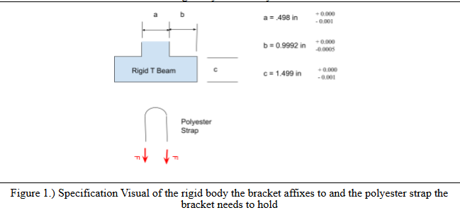

# A5 – Bracket Design

## Objective
This project tasked me to create a bracket to hold a symmetrically applied horizontal force via a strap. This bracket must have its dimensions designed with different fit classes in mind. 

The objective of this project is primarily to add stiffness analysis as a tool to be used to create engineering designs. Throughout this project, I will continue to follow the familiar strategy of creating free body diagrams of each element, identifying knowns and unknowns, stating assumptions, and performing stress analysis. However, I will now also complete this process using stiffness analysis as well, given deflection constraints. I can then compare the two results and reflect on how their results compare. 

## Analyze

>Specifications

The design of the bracket revolved around the specifications of the rigid body that it would attach to. The rigid body had specific dimensions given with tolerances, which I determined would lead me with a choice on how to approach the clearance fits of each feature of the bracket. Beyond these dimensions, the force range that the strap would apply was also given, ranging from 500 lbF to 800 lbF. Furthermore, a safety factor of 4 was given to be applied to all calculations for each feature's dimensions. I was also given a choice between three materials, including aluminum 6061 T6, Steel (ASTM A36), or Titanium (Ti-6A1-V4). When calculating the dimensions based on stiffness, a deflection of 0.005 inches waws given to be used for each feature. 

The appendix of the document I was provided also gave a tip on how to approach the design of the bracket, splitting it into 5 features that needed to be designed:
- Cantilever beam supporting the strap
- Connecting rod to bracket body
- Base of bracket
- Sides of bracket
- Hooks of bracket

By keeping the design symmetrical, it allows the sides and hooks of the bracket to fall under one set of calculations. 

## Decide

## Communicate

