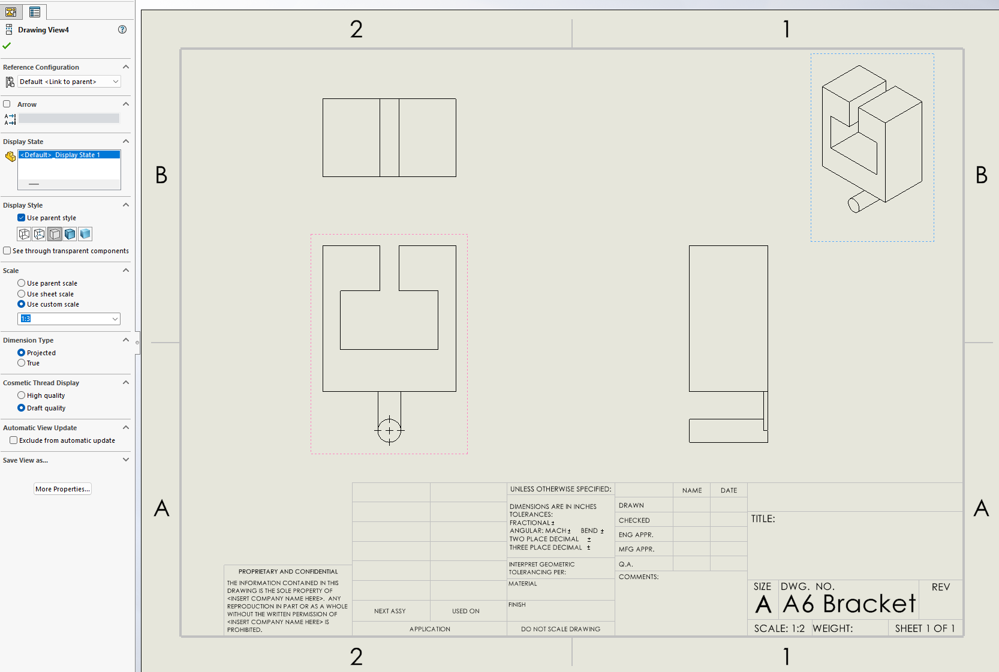

# A6 – Bracket Drawing Pt 1

## Objective

The objective of this project is to continue the design of the bracket made in A5. Specifically, this project aims to reference the dimensions calculated last week to make a parametric model and a detailed engineering drawing. This includes picking the dimensions that are best suited from both the stress and stiffness calculations, using the Equations tool to create a model that is defined parametrically, and using the model to create a drawing with proper dimensions and tolerances that suit the design. 

## Analyze

I began the creation of my parametric model by first analyzing the previous dimensions I had calculated for using both stress and stiffness. By creating multi-view sketches previously, I was able to easily compare the dimensions for both calculations. For each dimension, I chose the calculation that yielded the largest value, as it would ensure that the design would not fail through either stiffness or stress. To keep track, I marked each of the values I was gonna use with a red triangle on my sketches. 

I then translated these values into the equation tool in Solidworks, referencing the equations I had created for each dimension in project A5. I set each of the constant values to their corresponding value in the Equation tool, and then used those variables to input the equations of each dimension, checking with my hand calculated values to ensure their accuracy. I then labeled each global variable and provided a description to make it clear what they correlated with. Features 1-5 are numbered in the order they were calculated, moving up from the cantilever beam to the hook at the top of the bracket. 

I then went into the document properties of the part and ensured my units were set to IPS to match my previous calculations and ensure the model is accurate. Furthermore, I adjusted the decimal place that values were displayed to ensure the equations provided the result to the fourth decimal place. I also set the material to Aluminum 6061 T6, which although not utilized in this project, could prove useful later if testing is done on this model. 

## Decide

It was now time to create the model. Features 1-3 were simple, involving sketching and dimensioning their cross-section using the parametric values I created. I then used the extrude tool to extrude them to the desired length using the parametric values. For features 1 and 2, I used the back plane of the cantilever beam to create the sketches to ensure they were aligned and defined properly without the need to create relations manually. 

Features 4 and 5 took a few extra steps to create. I started with feature 4, creating the cross-section sketch using the back plane and extruding it to the correct length. I aligned it with the corner of feature 3 to ensure that the dimensioning was accurate with the placement of the feature. To fill in the joint between features 2 and 3, I added an extra sketch and extrude, merging the result to attach both features. 

This feature as well as feature 5 are symmetrical on both sides of the bracket. Using this relation, I was able to translate the features I created to the other side of the bracket using the mirror tool on both sketches. I drew a centerline in the middle of the bracket and used the line to mirror the sketches without the need for extra relations. Once I saved the sketch, it automatically extruded the new sketch and created a perfectly mirrored feature. 

I then repeated this process for feature 5, using the same method to fill the space at the joint and mirror both features. 

After completing feature 5, the part was complete and ready to be translated into a drawing. 

## Communicate
 
Tighter on side of bracket hook parallel to the base of the rigid T beam, as it ensures the bracket is able to fix to the T beam tightly without extra side to side movement that could misalign the strap or create forces that are not symmetrical to each side of the rigid T beam. This could create problems as the design was created with symmetry in mind. 

Looser on side of bracket hook parallel to "b" on the rigid T beam, as it does not need to be right up against the side of the T beam to support the forces on the strap.
